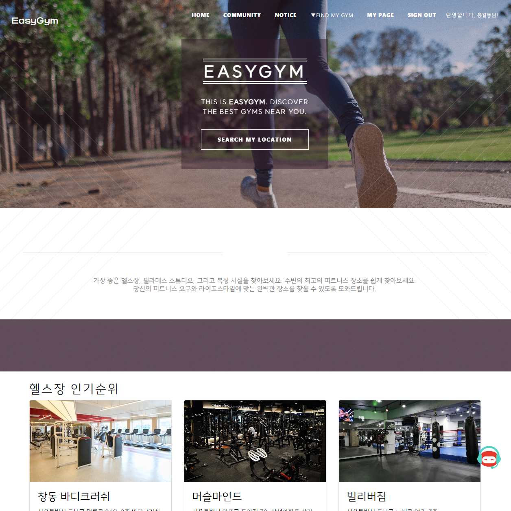

# EasyGym

   
  
   

## 프로젝트 소개
<h3 align="justify">
운동이 쉬워진다! 헬스장 정보 제공 웹서비스 페이지 프로젝트
</h3>
 

## 프로젝트 목적

### 1. 사용자와 시설업체간 중개
### 2. 사용자가 한 사이트에서 여러 운동 업체 및 위치를 쉽게 알 수 있도록 함
### 3. 사용자간 헬스 등 운동 정보 공유 커뮤니티 활성화

 

## 기술 스택

|  Java   |  JSP   | SpringBoot |    HTML / CSS / JS   | MySQL  |
|:-------:|:------:|:----------:|:--------------------:|--------|
| ![java] | ![jsp] |   ![sb]    | ![html] ![css] ![js] | ![sql] |

 

## 구현 기능

### 1. 운동 업체 리스트 및 지역별 지도 위치 제공

### 2. 사용자간 운동 정보 공유 커뮤니티 활성화를 위한 자유게시판 운영

### 3. 디테일한 헬스장 정보 제공 및 할인가 적용된 결제 시스템

### 4. 관리자 페이지, 업체 등록 페이지 구현

 

## 배운 점 & 아쉬운 점

<h4 align="justify">
1.이론만 배웠을 땐 어떻게 적용되는지에 대한 의구심이 있었으나, 직접 프로젝트를 하면서 이론으로 배웠던 기능들이 실전에서 이렇게 적용이 된다는 점에서 이해되지 않았던 이론 부분을 해소하는 시간이 되었음.

2.깃허브 푸쉬, 풀 과정에서 초기엔 코딩했던 것들이 엉키는 부분이 많았는데 점점 해결하는 과정에서 안정화되는 방법을 터득함.
</h4>

 

<!-- Stack Icon Refernces -->

[java]: src/main/resources/static/images/readme/java.png
[jsp]: src/main/resources/static/images/readme/jsp.png
[sb]: src/main/resources/static/images/readme/sb.png
[html]: src/main/resources/static/images/readme/html.png
[css]: src/main/resources/static/images/readme/css.png
[js]: src/main/resources/static/images/readme/js.png
[sql]: src/main/resources/static/images/readme/mysql.png

